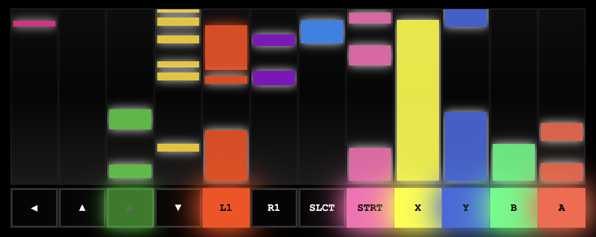

# Stream Pad

A web-based controller input visualizer that displays real-time button presses in a DDR/Guitar Hero style with colorful scrolling rectangles.

## ✨ Features

- **DDR-Style Visualization** - Button presses create colorful rectangles that scroll upward
- **Real-time Input** - Instant visual feedback with rectangle length matching press duration
- **Multiple Controller Support** - Works with Switch, Xbox, PlayStation, and more
- **Zero Dependencies** - Pure HTML/CSS/JS implementation

## 🚀 Quick Start

1. Open `index.html` in a modern web browser
2. Connect your controller via USB or Bluetooth
3. Press any button to see colorful rectangles scroll upward
4. Hold buttons longer to create longer rectangles!

## 🎮 How It Works

- **Tap a button** → Short colored rectangle appears and scrolls up
- **Hold a button** → Rectangle grows longer while held, then scrolls up when released
- **Each button** has its own unique vibrant color
- **Press ESCAPE** to fix any stuck buttons