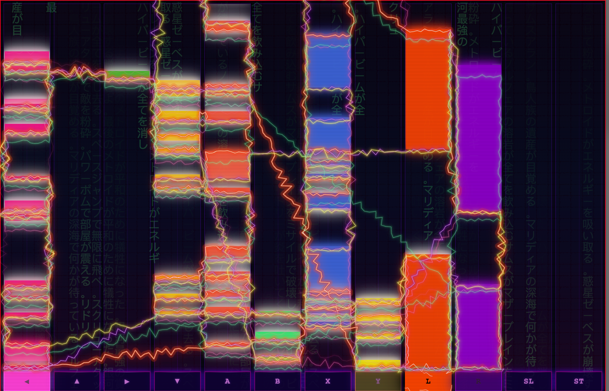
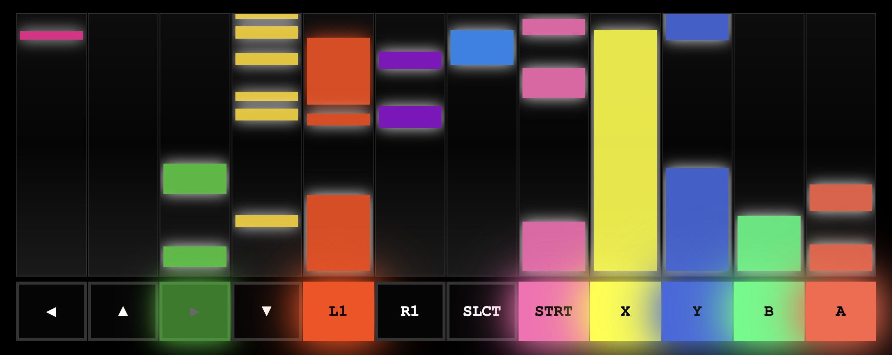

# StreamPad

A web-based controller input visualizer that displays real-time button presses in a DDR/Guitar Hero style with colorful scrolling rectangles.





## Quick Start

1. Open `streampad.html` (neon version with effects) or `index.html` (minimal) in a modern web browser
2. Connect your controller via USB or Bluetooth
3. Press any button to see colorful rectangles scroll upward
4. Hold buttons longer to create longer rectangles!
5. Press **ESCAPE** to fix any stuck buttons

## Files

- **`streampad.html`** - Neon-themed version with starfield, visual effects, and query param controls
- **`index.html`** - Original minimal version
- **`streampad.py`** - Python/Pygame version

## Query Parameters (streampad.html)

All effects are applied via URL query parameters.

### Layout

| Parameter | Example | Description |
|-----------|---------|-------------|
| `spacing` | `?spacing=10` | Gap in pixels between each lane (default: 3) |

### Visual Effects

| Parameter | Example | Description |
|-----------|---------|-------------|
| `glow` | `?glow=true` | Intense glow on buttons, notes, and lane borders |
| `pulse` | `?pulse=true` | Pulsing/breathing lane border animation |
| `flash` | `?flash=true` | Bright flash on button press |
| `rainbow` | `?rainbow=true` | Rainbow cycling border around the view |
| `scanlines` | `?scanlines=true` | CRT scanline overlay |
| `vaporwave` | `?vaporwave=true` | Pink/cyan vaporwave color scheme |
| `lightning` | `?lightning=true` | Ghostbusters-style energy beams that lock onto and chain between rising notes while a button is held. Electricity crackles around the pressed button. |
| `lightningMaxAngle` | `?lightningMaxAngle=15` | Max jitter angle in degrees for lightning beam segments (default: 25, range: 1-90). Lower = tighter beam, higher = wilder arcs. |
| `all` | `?all=true` | Enable all effects at once |

### SNI (Real SNES Hardware)

| Parameter | Example | Description |
|-----------|---------|-------------|
| `sni` | `?sni=true` | Read controller input from real SNES hardware via [SNI](https://github.com/alttpo/sni) gRPC-web. Requires SNI running and a game loaded on FXPak Pro. |
| `sniUrl` | `?sniUrl=http://localhost:8190` | Custom SNI gRPC-web URL (default: `http://localhost:8190`) |

> **Note:** SNI mode requires serving via a local HTTP server (e.g. `python -m http.server 8000`) due to CORS. Open `http://localhost:8000/streampad.html?sni=true` instead of using `file://`.

### Background

| Parameter | Example | Description |
|-----------|---------|-------------|
| `stars` | `?stars=false` | Disable the starfield background (enabled by default) |
| `matrix` | `?matrix=true` | Matrix-style falling characters background |
| `matrixSpeed` | `?matrixSpeed=10` | Matrix fall speed, 1 (slow) to 100 (fast). Default: 20 |
| `matrixChars` | `?matrixChars=ABCDEFG` | Custom characters for the matrix rain. Each character in the string is used individually. Supports any Unicode including CJK, kana, emoji, etc. |
| `matrixCharsMaxSize` | `?matrixCharsMaxSize=24` | Max font size in pixels for matrix characters (default: 14, range: 8-72) |
| `matrixPreserveOrder` | `?matrixPreserveOrder=true` | Characters fall in sequence order instead of random, so words/phrases are readable in each column. Each column starts at a random offset for variety. |

### Example URLs

```
streampad.html?glow=true&lightning=true
streampad.html?matrix=true&matrixSpeed=10&matrixChars=あいうえおかきくけこ&matrixCharsMaxSize=20
streampad.html?matrix=true&matrixChars=我是个疯子傻逼麻婆豆腐&matrixCharsMaxSize=28
streampad.html?matrix=true&matrixChars=スーパーメトロイドサムス戦闘攻撃防御必殺技剣盾魔法炎雷氷&matrixPreserveOrder=true&matrixCharsMaxSize=22&matrixSpeed=12
streampad.html?vaporwave=true&scanlines=true&glow=true
streampad.html?all=true
streampad.html?spacing=8&lightning=true&pulse=true
streampad.html?lightning=true&lightningMaxAngle=10&glow=true
streampad.html?lightning=true&lightningMaxAngle=50
streampad.html?stars=true&glow=true&spacing=10&pulse=true&flash=true&rainbow=true&scanlines=true&matrix=true&vaporwave=true
```

SNI mode (real SNES hardware via FXPak Pro):
```
http://localhost:8000/streampad.html?sni=true&lightning=true
```

My primary config
```
/streampad.html?stars=true&glow=true&spacing=10&pulse=true&flash=true&rainbow=true&scanlines=true&matrix=true&vaporwave=true&lightning=true&lightningMaxAngle=55&matrixPreserveOrder=true&matrixCharsMaxSize=32&matrixSpeed=1&matrixChars=サムスがマザーブレインをミサイルで破壊した。ハイパービームが全てを消し去る。スペースジャンプで無限に飛べ。スクリューアタックで敵を粉砕。パワーボムで部屋が震える。リドリーが炎を吐いてくる。クレイドの腹を撃ち抜け。ドレイゴンを凍らせて粉砕。メトロイドがエネルギーを吸い取る。惑星ゼーベスが崩壊する脱出せよ。最後のメトロイドが平和のために犠牲になった。銀河最強の賞金稼ぎサムスアラン。鳥人族の遺産が目覚める。マリディアの深海で何かが待っているノルフェアの溶岩が全てを飲み込む
```

## Supported Controllers

### Fully Tested & Working
- **Nintendo Switch Pro Controller** - Full button mapping, D-pad via buttons
- **Nintendo SNES Controller (USB/Switch Online)** - Full button mapping, D-pad via axes
- **PlayStation 4 (DualShock 4)** - Standard mapping
- **PlayStation 5 (DualSense)** - Standard mapping
- **Xbox Controllers** - Standard mapping
- **8BitDo SN30 Pro** - Standard mapping

## Button Layout

Lanes are ordered: **D-pad (< ^ > v) | A B X Y | L R | SL ST**

When a Switch Pro Controller is detected, ZL/ZR lanes are added automatically.

## Troubleshooting

### Controller Not Detected
- Try unplugging and replugging the controller
- Refresh the page after connecting
- Check browser console for error messages

### Controller Issues?
1. **Use the Debug Tool**: Open `controller_debug.html` to see exactly what your controller reports
2. **Browser Compatibility**: Chrome/Edge have the best Gamepad API support
3. **Connection Method**: USB vs Bluetooth can report differently

### Stuck Buttons
- Press **ESCAPE** key to clear all stuck states
